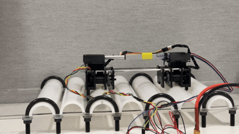
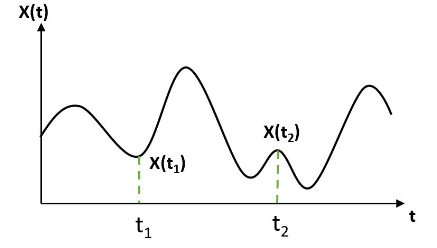
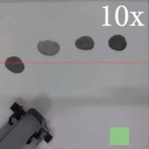
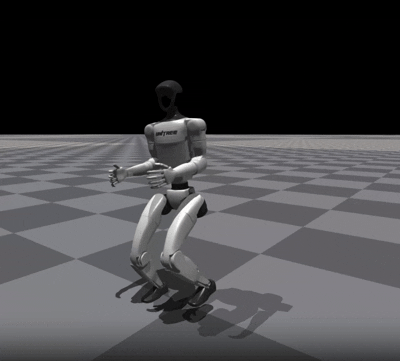

# Portfolio

<figure class="portfolio-hero">
  
  <figcaption>
    Illustration related to the Principle of Least Action. <cite><a href="https://www.feynmanlectures.caltech.edu/II_19.html" target="_blank" rel="noopener">Feynman Lectures, Ch.19</a></cite>
  </figcaption>
</figure>

Principle of Least Action is one of my favorite topics in physics. This perspective unifies mechanics, optics, and field theory, reveals deep symmetries and conservation laws, and often leads to unexpectedly simple descriptions of complex behavior. Its elegance and explanatory power have strongly influenced how I approach problems in my projects.

## Current Projects

  

     
     

       

         <h3>BECOv2</h3>
         
Multi-Agents Robot Locomotion on Irregular Terains

       

     

  

  

     
     

       

         <h3>Time Series Analysis(Undergraduate Thesis)</h3>
         
An application of Deep Learning

       

     

  

## Past Projects

  

     
     

       

         <h3>DiffusiveGRAIN</h3>
         
Repositioning Rocks Through Strategic Sand Avalanche

       

     

  

  

     
     

       

         <h3>Humanoid Robot Tele-Operation</h3>
         <!-- 
Multi-Agents Robot Locomotion on Irregular Terains
 -->
       

     

  

  

     
     

       

         <h3>Inverted Cart</h3>
         
An application of Modern Controller

       

     

  

  

     
     

       

         <h3>Electric Guitar</h3>
         
A self-made guitar by designing the circuit

       

     

  

  

     
     

       

         <h3>Math Tutor</h3>
         
AI math tutor by leveraging ChatGPT API

       

     

  

  

     
     

       

         <h3>Bicycle Accident Auto-Detection</h3>
         

       

     

  

## Art Projects

  

     
     

       

         <h3>2750</h3>
         
Imagination of Future

       

     

  

