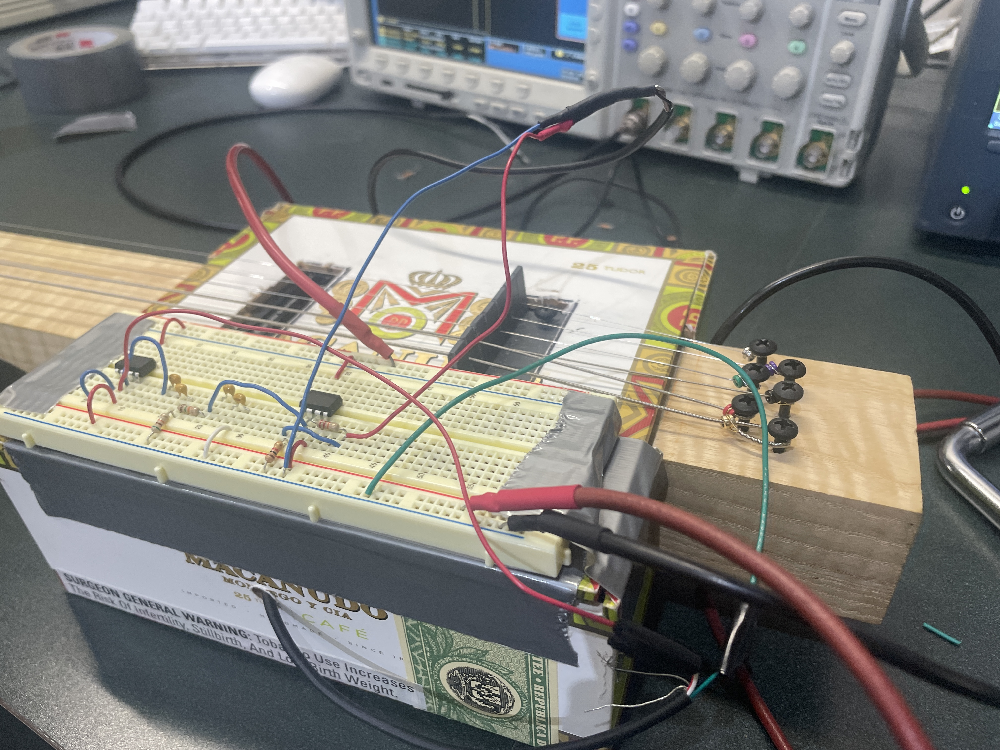
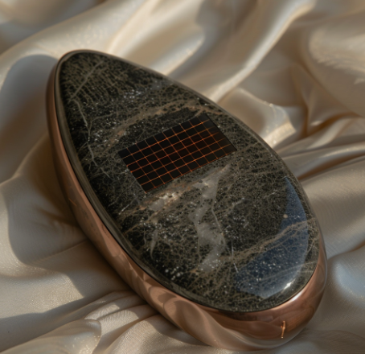
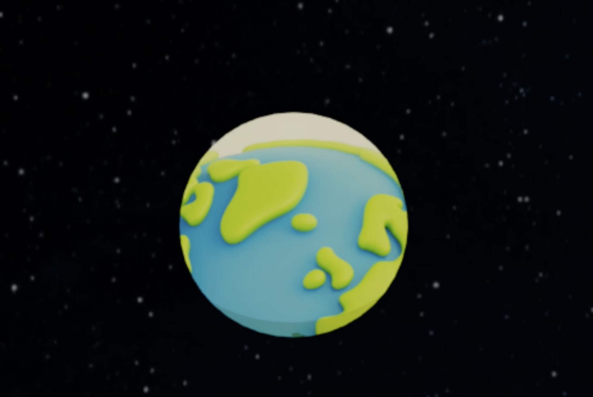

# Portfolio

<figure class="portfolio-hero">
  
  <figcaption>
    Illustration related to the Principle of Least Action. <cite><a href="https://www.feynmanlectures.caltech.edu/II_19.html" target="_blank" rel="noopener">Feynman Lectures, Ch.19</a></cite>
  </figcaption>
</figure>

Principle of Least Action is one of my favorite topics in physics. This perspective unifies mechanics, optics, and field theory, reveals deep symmetries and conservation laws, and often leads to unexpectedly simple descriptions of complex behavior. Its elegance and explanatory power have strongly influenced how I approach problems in my projects.

## Current Research Projects

  <!-- BECOv2 -->
  

    
    

      

        <h3>BECOv2</h3>
        <h5>2025</h5>
        
Multi-Agents Robot Locomotion on Irregular Terrains

      

    

    

      
Research Group: <a href="https://sites.google.com/usc.edu/roboland">RoboLAND</a>

      <!-- 
Multi-agent locomotion on irregular terrains. Includes training pipeline, robustness tests, and ROS/Webots demos.

      <ul>
        <li>Terrain randomization & parameter sweeps</li>
        <li>Dynamics sim + domain randomization</li>
        <li>Behavior cloning + RL fine-tuning</li>
      </ul> -->
    

  

  <!-- Time Series Analysis -->
  

     
     

       

         <h3>Time Series Analysis(Undergraduate Thesis)</h3>
         <h5>2025-2026</h5>
         
An application of Deep Learning

       

     

     

        <!-- 
Code: <a href="#">Github</a>
 -->
       
Coming soon...

     

  

  <!-- Hopper -->
  

     
     

       

         <h3>Hopper</h3>
         <h5>2025-2026</h5>
         

       

     

     

     
Research Group: <a href="https://sites.google.com/usc.edu/roboland">RoboLAND</a>

       <!-- 
Single-leg hopping control with disturbance recovery. Simulation-to-real notes and controller tuning logs.
 -->
       
Coming soon...

     

  

## Past Research Projects

  <!-- DiffusiveGRAIN -->
  

     
     

       

         <h3>DiffusiveGRAIN</h3>
         <h5>2024-2025</h5>
         
Repositioning Rocks Through Strategic Sand Avalanche

       

     

     

       
Research Group: <a href="https://sites.google.com/usc.edu/roboland">RoboLAND</a>

       
Project Website: <a href="https://sites.google.com/view/diffusivegrain/home">DiffusiveGRAIN</a>

       
Paper: <a href="https://arxiv.org/pdf/2505.12934d">Link</a>

       
Study of granular media manipulation via controlled avalanches to reposition embedded objects.

       <ul>
         <li>Granular flow modeling</li>
         <li>Shape & friction sensitivity</li>
         <li>Real-world sandbox experiments</li>
       </ul>
     

  

  <!-- Humanoid Tele-Op -->
  

     
     

       

         <h3>Humanoid Robot Tele-Operation</h3>
         <h5>2025</h5>
       

     

     

       
Research Group: <a href="https://embodied-agi.cs.umass.edu/">Embodied AGI</a>

       <!-- 
Low-latency teleoperation pipeline for a humanoid platform. Includes retargeting, filtering, and safety limits.

       <ul>
         <li>Pose retargeting & IK constraints</li>
         <li>Network latency compensation</li>
         <li>Safety envelopes & failsafes</li>
       </ul> -->
     

  

  <!-- Math Tutor -->
  

     
     

       

         <h3>Math Tutor</h3>
         <h5>2023-2024</h5>
         
AI math tutor by leveraging ChatGPT API

       

     

     

       
Research Group: <a href="https://anrg.usc.edu/www/">ANRG</a>

       
Conversational math tutoring with step-by-step hints and automatic problem generation.

       <!-- <ul>
         <li>Curriculum tagging & spaced review</li>
         <li>Error-aware hinting</li>
         <li>Latex rendering & export</li>
       </ul> -->
     

  

## Personal and Art Projects

  

    
    

      

        <h3>Wavelet Transformation Visualization</h3>
        <h5>2025</h5>
        

      

    

    

      <!-- 
Website: <a href="#">Link</a>
 -->
      
Coming soon...

      <!-- <ul>
        <li>System ID & noise modeling</li>
        <li>LQR/LQG comparisons</li>
        <li>Hardware demo notes</li>
      </ul> -->
    

  

  <!-- Inverted Cart -->
  

     
     

       

         <h3>Inverted Cart</h3>
         <h5>2025</h5>
         
An application of Modern Controller

       

     

     

       
Modern control on inverted pendulum: linearization, LQR, and reference tracking with integral action.

       <ul>
         <li>System ID & noise modeling</li>
         <li>LQR/LQG comparisons</li>
         <li>Hardware demo notes</li>
       </ul>
     

  

  <!-- Electric Guitar -->
  

     
     

       

         <h3>Electric Guitar</h3>
         <h5>2024</h5>
         
A self-made guitar by designing the circuit

       

     

     

       
Hand-wired electric guitar project including pickup selection, tone circuit design, and shielding.

       <ul>
         <li>Active vs passive tone stacks</li>
         <li>Noise & shielding experiments</li>
         <li>Custom pickguard CAD</li>
       </ul>
     

  

  <!-- Bicycle Accident Auto-Detection -->
  

     
     

       

         <h3>Bicycle Accident Auto-Detection</h3>
         <h5>2023</h5>
         

       

     

     

       
On-device fall detection using accelerometer/gyroscope signals and simple ML classifiers.

       <ul>
         <li>Signal processing & thresholds</li>
         <li>False positive reduction</li>
         <li>BLE alert prototype</li>
       </ul>
     

  

  <!-- 300 Years From Now -->
  

     
     

       

         <h3>300 Years From Now</h3>
         <h5>2025</h5>
         
An imagination of the future

       

     

     

       
A speculative visual essay exploring long-horizon civilizational design and human–AI collaboration.

       <ul>
         <li>Worldbuilding sketches</li>
         <li>Tech/social trade-offs</li>
         <li>Short narrative vignettes</li>
       </ul>
     

  

  <!-- Humor Video -->
  

     
     

       

         <h3>Humor Video</h3>
         <h5>2023</h5>
         
Maya animation project

       

     

    

      

        <video controls playsinline preload="metadata" poster="../images/portfolio/CTAN452.png">
          <!-- 用站点根路径最稳：按你的目录调整成 /videos/...  -->
          <source src="../videos/CTAN452.mp4" type="video/mp4" />
          <!-- 可选：再提供 webm 以做兜底 -->
          <!-- <source src="/videos/CTAN452.webm" type="video/webm" /> -->
          Your browser does not support the video tag.
        </video>
      

    

  

  <!-- Spacetravel -->
  

    
    

      

        <h3>Spacetravel</h3>
        <h5>2021</h5>
        
A tiny sci-fi film made in highschool

      

    

  

    

      <video controls playsinline preload="metadata" poster="../images/portfolio/sci_fi.png">
        <!-- 用站点根路径最稳：按你的目录调整成 /videos/...  -->
        <source src="../videos/Space.mp4" type="video/mp4" />
        <!-- 可选：再提供 webm 以做兜底 -->
        <!-- <source src="/videos/CTAN452.webm" type="video/webm" /> -->
        Your browser does not support the video tag.
      </video>
    

  

  

## Failed Projects

  <!-- IMU Glove -->
  

     
     

       

         <h3>IMU Glove</h3>
         <h5>2024</h5>
         
A glove that tracks the position of the hands

       

     

     

       
IMU-based hand pose capture glove. Lessons learned on drift, calibration, and fusion filters.

       <ul>
         <li>Per-finger IMU placement</li>
         <li>Complementary vs EKF</li>
         <li>Drift mitigation experiments</li>
       </ul>
     

  

