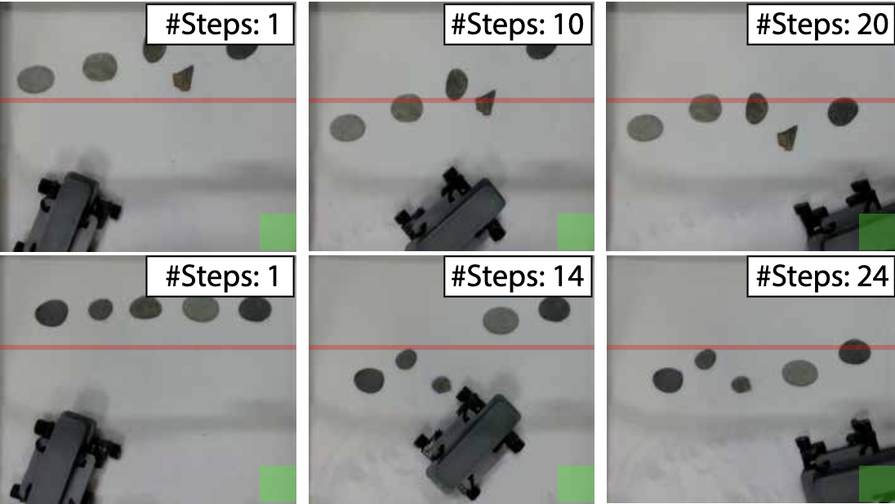

<!-- lastUpdated: 2025-09-30 -->

<!-- # Welcome! -->

<!-- <a href="https://github.com/YOUR_USERNAME" target="_blank">
  <i class="fab fa-github fa-2x"></i>
</a>

<a href="https://scholar.google.com/citations?user=YOUR_ID" target="_blank">
  <i class="fa-solid fa-graduation-cap fa-2x"></i>
</a>     -->

# Jerry Wu （吴越）
Hi, I am Jerry, my legal name is Yue Wu. I am currently a 4th year undergraduate majoring Electrical and Computer Engineering in [Viterbi School of Engineering, University of Southern California](https://www.viterbi.usc.edu/)
. My recent research interests mainly focus on robots locomotion and machine learning, supervised by Professor [Feifei Qian](https://sites.google.com/usc.edu/roboland) and Professor [Dainel Seita](https://danielseita.github.io/).

During summer 2025, I was fortunate to work with Professor [Chuang Gan](https://people.csail.mit.edu/ganchuang/) at [University of Massachusetts Amherst](https://www.cics.umass.edu/) on Humanoid Robot. Before joined the research labs,  I was part of [USC Racing Team](https://www.uscformulasae.com/), where I mainly contributed to the Electronics subteam.

In my free time, I enjoy watching movies and sometimes even help friends with their film projects. I appreciate all kinds of cinema, especially emerging forms such as VR, AR and AI generated movies.

contact me: email: ywu30861@usc.edu ｜ message: 213-716-6120

## Publications

    

    Granular Loco-Manipulation: Repositioning Rocks Through Strategic Sand Avalanche
    

H. Hu, Y. Wu, D. Seita*, F. Qian*, Conference on Robot Learning (CoRL), 2025.

    <a href="https://arxiv.org/pdf/2505.12934" target="_blank">PDF</a>
    <a href="https://sites.google.com/view/diffusivegrain/home" target="_blank">Project Website</a>

